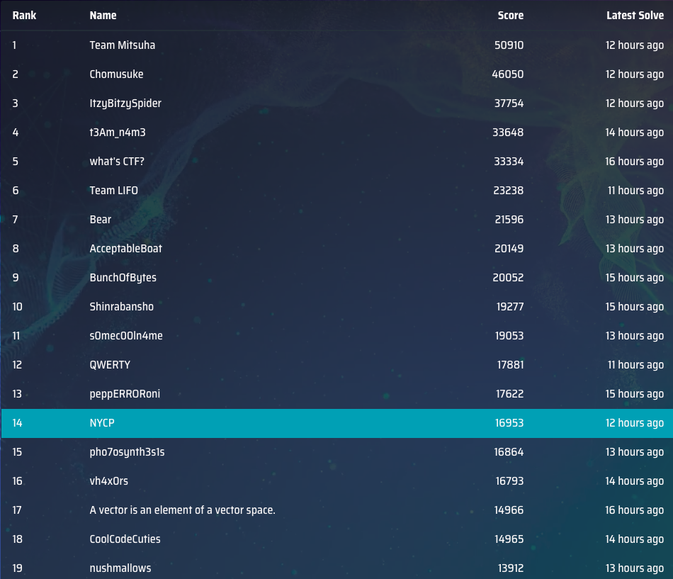

# stack-the-flags-writeups
## What is STACK the Flags?
STACK the Flags 2020 is an online, jeopardy style Capture-the-Flag competition organised by the folks in GovTech’s Cyber Security Group (CSG). As part of ongoing efforts to engage the technology community, this CTF is open to everyone! At the end of the competition, attractive prizes will be awarded to the top teams.
## What are the types of challenges?
There will be 11 challenge categories:

- Binary Exploitation
- Cloud
- Cryptography
- Forensics
- Internet of things (IoT)
- Miscellaneous
- Mobile
- Open Source Intelligence (OSINT)
- Reverse Engineering (RE)
- Social Engineering (SE)
- Web

## My Team
My team, NYCP, participated in Category 3 - Junior Colleges, Integrated Programmes and Institutes of Technical Education and achieved a rank of 14 out of 53.

