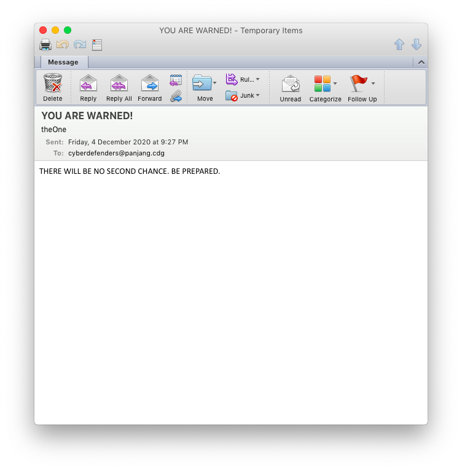
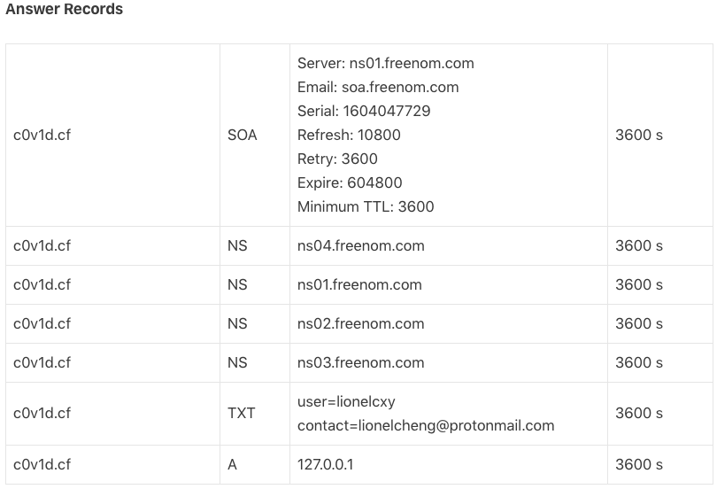
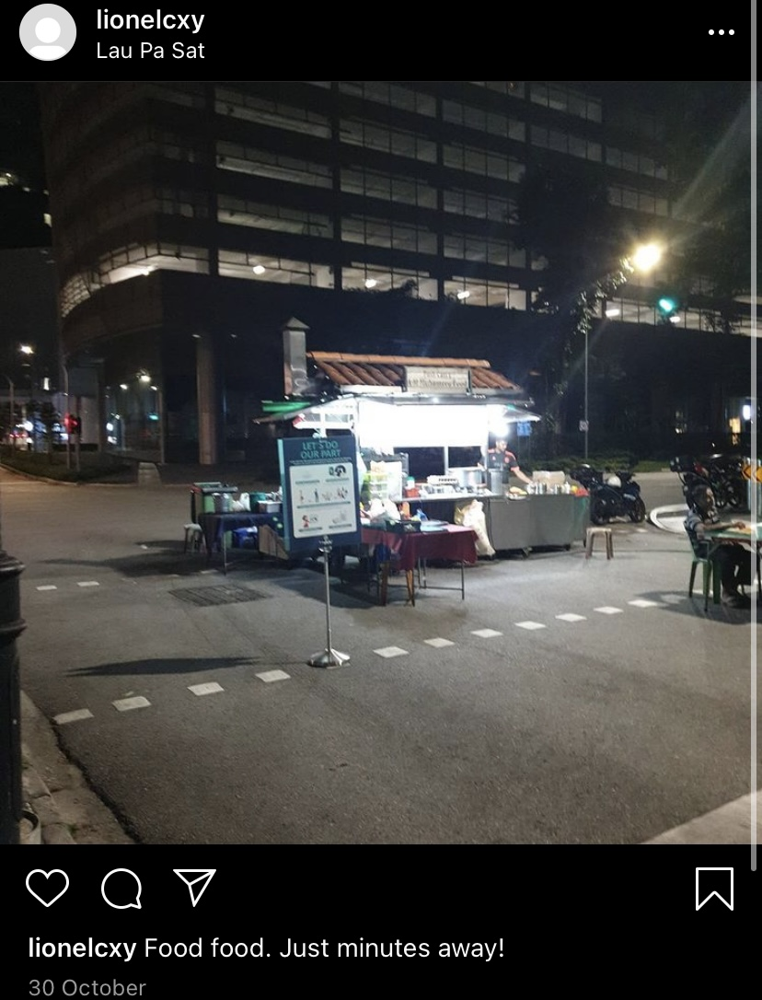
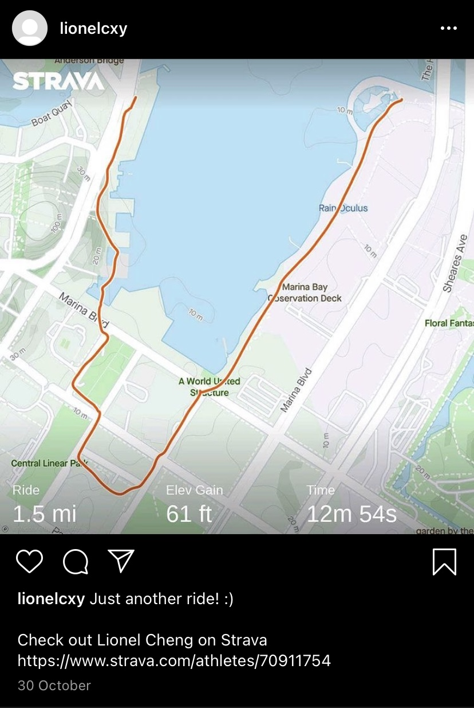
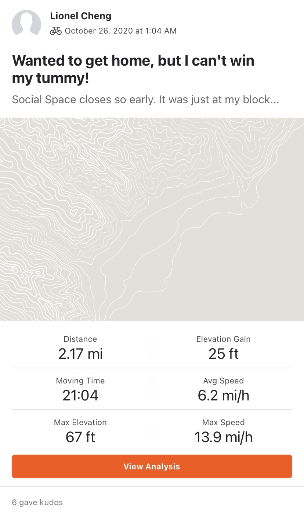
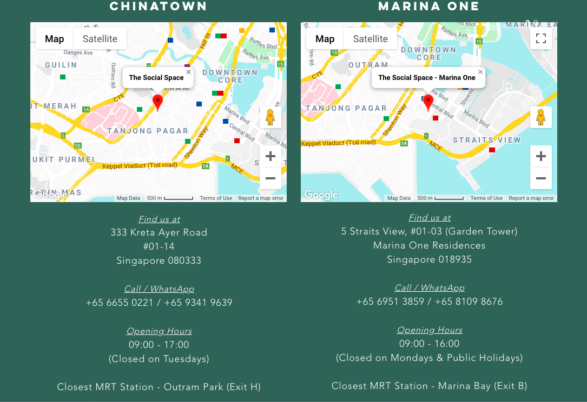

# Hunt him down!
1000 points (970 at the end of the competition due to dynamic scoring) 
14 solves 
Codename: osint-challenge-8
## DESCRIPTION
After solving the past two incidents, COViD sent a death threat via email today. Can you help us investigate the origins of the email and identify the suspect that is working for COViD? We will need as much information as possible so that we can perform our arrest!

Download

Example Flag: govtech-csg{JohnLeeHaoHao-123456789-888888}

Flag Format: govtech-csg{fullname-phone number[9digits]-residential postal code[6digits]}

This challenge:
- Is eligible for Awesome Write-ups Award
- Prerequisite for Mastery Award - Intelligence Officer

_Notes:_
- _This challenge was solved after the competition._

## WRITEUP
In this challenge, we only get a single email to start with. This gives us limited information to work with. This is actually good because it allows us to identify the useful data immediately and work from there, instead of trawling through a lot of data like in other osint challenges.

We can see that the only useable information to lead to the suspect is his email: `theOne@c0v1d.cf`. So we do a DNS lookup on the domain `c0v1d.cf`.

This yields the following results.

Of interest is the TXT record `user=lionelcxy contact=lionelcheng@protonmail.com`.

We can then search this information on Google. A search on `lionelcxy` brings up his Instagram and Carousell accounts as the top 2 results.

> Fun fact: Strava is an app that tracks one's exercise using GPS. The online fitness tracker has even showed where secret US military bases are! https://www.bbc.com/news/technology-42853072

His [Instagram](https://www.instagram.com/lionelcxy/
) does not contain any of the information that is part of the flag, but gives clues as to his address. "Just minutes away" suggests that he lives near Lau Pa Sat.

It also contains a hint for us to pivot to [Strava](https://www.strava.com/athletes/70911754).

Searching [Social Space](https://www.thesocialspace.co/) on Google, gives 2 results.

Both locations are quite near Lau Pa Sat, so both locations are possible. However, it is more likely that he lives in `MarinaOne Residences (postal code 018935)` since he cycles in the Marina Bay area.

From his [Carousell](https://www.carousell.sg/lionelcxy/) account, we can get his phone number `963672918` from his [listing](https://sg.carousell.com/p/1045623891) below. We can also confirm that the postal code we obtained is correct as City Hall MRT is quite close to MarinaOne.

A search on his email address from the DNS record brings up his [LinkedIn profile](https://www.linkedin.com/in/cheng-xiang-yi-0a4b891b9/).

This gives us his full name `Lionel Cheng Xiang Yi`.

## FLAG
`govtech-csg{LionelChengXiangYi_963672918_018935}`
