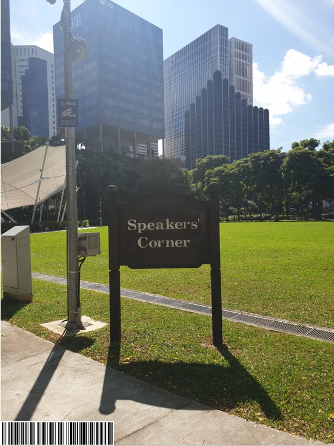

# Only time will tell!
1000 points (691 points at the end of the competition due to dynamic scoring)<br>
34 solves<br>
Codename: osint-challenge-6

## DESCRIPTION

This picture was taken sent to us! It seems like a bomb threat! Are you able to tell where and when this photo was taken? This will help the investigating officers to narrow down their search! All we can tell is that it's taken during the day!

If you think that it's 7.24pm in which the photo was taken. Please take the associated 2 hour block. This will be 1900-2100. If you think it is 10.11am, it will be 1000-1200.

Flag Example: govtech-csg{1.401146_103.927020_1990:12:30_2000-2200}

Download

Flag Format: govtech-csg{lat_long_date_[two hour block format]}
Use this [calculator](https://www.pgc.umn.edu/apps/convert/)!

This challenge:
- Unlocks other challenge(s)
- Is eligible for Awesome Write-ups Award
- Prerequisite for Mastery Award - Intelligence Officer

Addendum:
- The amount of decimal places required is the same as shown in the example given.
- CLI tool to get something before you convert it with the calculator.

Notes:
- Hints are attached at the end of this writeup.
- This challenge was solved after the competition.

## WRITEUP
In this challenge, we need to obtain 3 pieces of information from the image given below - GPS coordinates, Date taken and Time taken.




We can get the GPS coordinates from the image metadata using exiftool.
```
ExifTool Version Number         : 12.01
File Name                       : osint-challenge-6.jpg
Directory                       : .
File Size                       : 123 kB
File Modification Date/Time     : 2020:12:04 13:52:27-05:00
File Access Date/Time           : 2020:12:04 13:52:31-05:00
File Inode Change Date/Time     : 2020:12:04 13:52:27-05:00
File Permissions                : rw-r--r--
File Type                       : JPEG
File Type Extension             : jpg
MIME Type                       : image/jpeg
JFIF Version                    : 1.01
X Resolution                    : 96
Y Resolution                    : 96
Exif Byte Order                 : Big-endian (Motorola, MM)
Make                            : COViD
Resolution Unit                 : inches
Y Cb Cr Positioning             : Centered
GPS Latitude Ref                : North
GPS Longitude Ref               : East
Image Width                     : 551
Image Height                    : 736
Encoding Process                : Baseline DCT, Huffman coding
Bits Per Sample                 : 8
Color Components                : 3
Y Cb Cr Sub Sampling            : YCbCr4:2:0 (2 2)
Image Size                      : 551x736
Megapixels                      : 0.406
GPS Latitude                    : 1 deg 17' 11.93" N
GPS Longitude                   : 103 deg 50' 48.61" E
GPS Position                    : 1 deg 17' 11.93" N, 103 deg 50' 48.61" E
```

We can then use the calculator in the challenge description to convert it to the desired format: `1.286647, 103.8468361`.

> Note: This question can only be solved using exiftool. If the image metadata is viewed using other software like macOS Preview, the GPS coordinates will be different as it is reported to a higher number of decimal places. This was the main reason why we could not solve this challenge during the competition.<br>
>  <br>
> This yields `1.286648_103.846835`.

For the date, we can use a online barcode reader to decode the barcode in the picture which gives `25 October 2020`.


Lastly, for the time, we can just brute force since there is unlimited submissions and the number of possibilities is small.

Alternatively, we can look up the place on [Google Street View](https://www.google.com.sg/maps/@1.2867278,103.846962,3a,75y,234.16h,90t/data=!3m8!1e1!3m6!1sAF1QipNFaCbOQTMBklFQZrNypbRJ2TquH0_wTiFhh7Dh!2e10!3e11!6shttps:%2F%2Flh5.googleusercontent.com%2Fp%2FAF1QipNFaCbOQTMBklFQZrNypbRJ2TquH0_wTiFhh7Dh%3Dw203-h100-k-no-pi4.669593-ya324.21057-ro0.5352531-fo100!7i5376!8i2688) with our GPS coordinates above.


We can see from the compass that the camera is directed towards the West. From the direction of the shadow in the picture, we can tell it is taken in the afternoon. From the angle of the shadow, we can estimate that it was at around `3 - 5 pm`.

## FLAG
`govtech-csg{1.286647_103.846836_2020:10:25_1500-1700}`

## HINTS
1. From the shadows, we can tell time.
